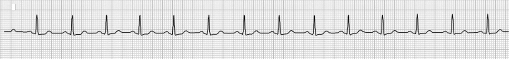
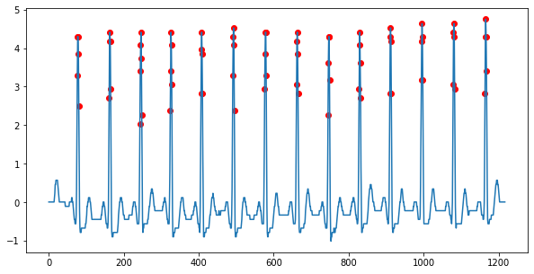
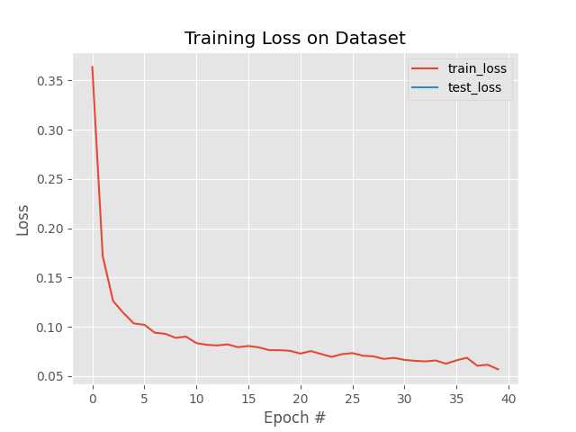
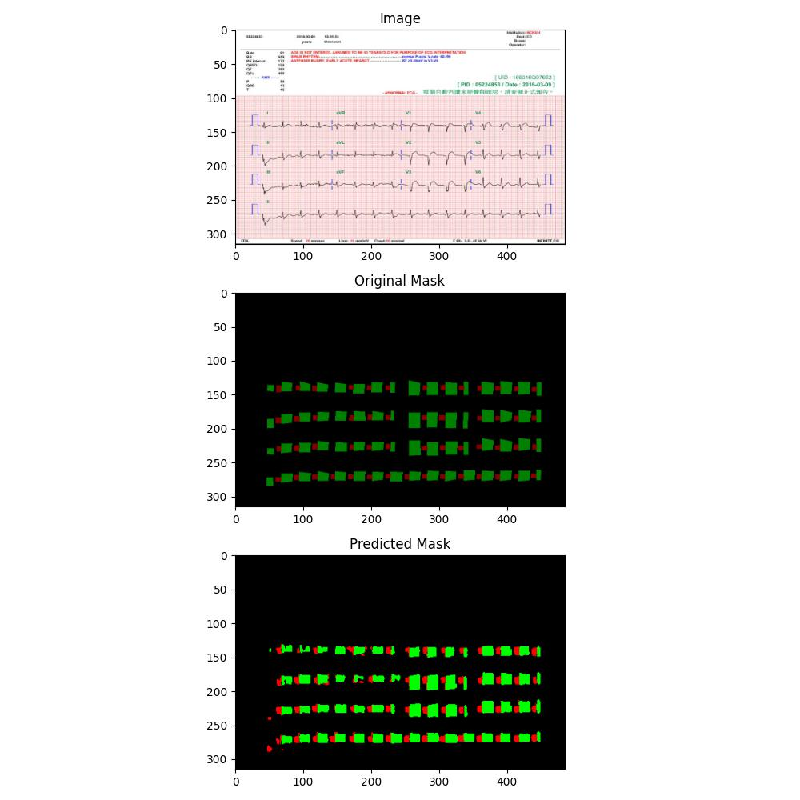

# AIMAS HW1

Q56104076 陳哲緯

# install

```python
pipenv shell      # enter virtual environment
pipenv install    # install needed package
```

## dataset

The dataset should be placed like:

```
├─EKG_seg
│  ├─0_json
│  ├─1000_json
├─EKG_unzip
│  ├─EKG_001-120
│  ├─EKG_121-240
│  ├─EKG_241-360
│  ├─EKG_361-480
│  └─EKG_481-600
├─imageseg
└─output
└─Q1.py
└─Q2.py
└─Q3.py
└─train.py
└─Pipfile
└─Pipfile.lock
```

# Q1

+ for each image under EKG_unzip, split it to 12 parts and save as  **Q1_data.pkl**

```
python Q1.py
```

# Q2

+ load 10s long lead II from **Q1_data.pkl** 
+ extract siganl by finding black pixel in image
+ counting heart beat by **cross corrrelation** 
+ save output as Q2.csv (column = ["image_path" , "heart beat"])
```
python Q2.py
```



# Q3
+ train Unet model for segment p(red) and qrs(green) 
+ set model config in **imageseg/config.py**

> train model
+ you can set model config like batch or epoch in imageseg/config.py
```
python train.py
```
> test model
+ load model **Q3-model.pt**
+ randomly choice 10 image and test it,save outcome under output folder
```
python Q3.py
```


## Q3-result
> training loss


> predict
