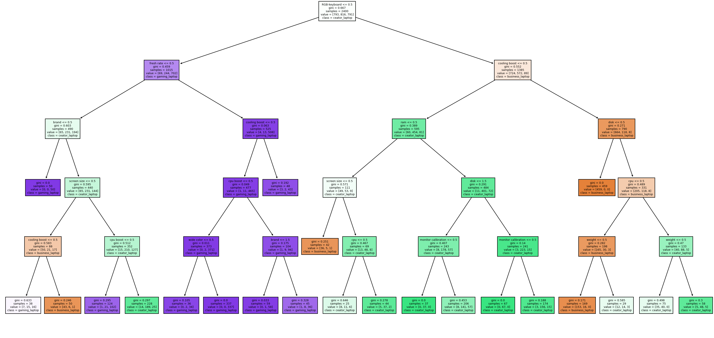
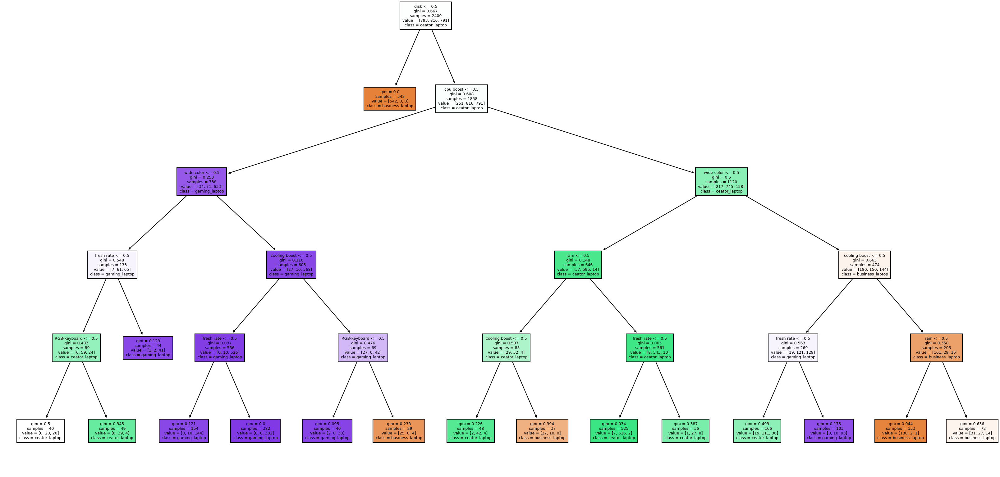
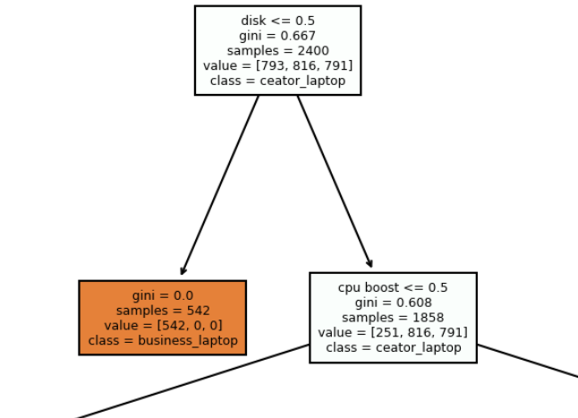
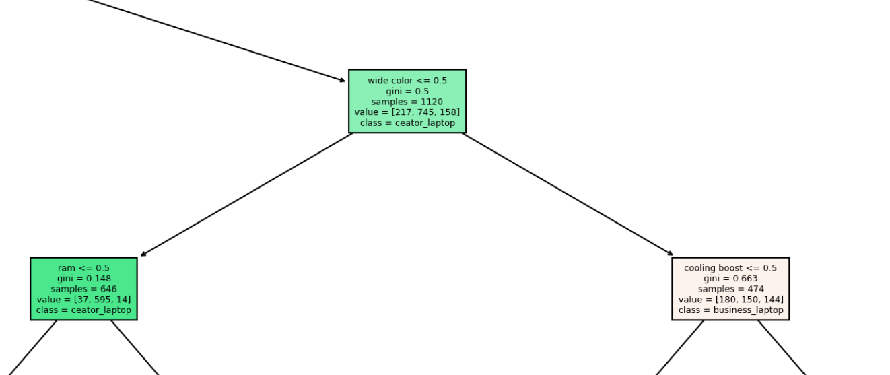
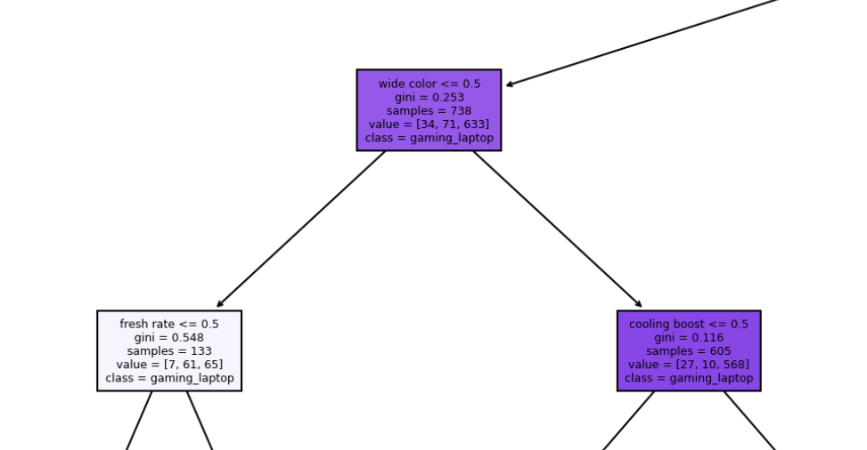

# HW2 Q56104076陳哲緯

+ 主題 : 筆電分析，分成三種:
	+ 商務筆電 
	+ 電競筆電 
	+ 創作者筆電

## 筆電特色

| 類型       | 重點特色                                          | 解釋                                               |
| ---------- | ------------------------------------------------- | -------------------------------------------------- |
| 商務筆電   | 機身重量,商品品牌,機身重量,硬碟                   | VAIO品牌只出商務筆電，硬碟128G只會出現在商務筆電上 |
| 電競筆電   | RGB鍵盤背光,顯卡,散熱功能強化,螢幕更新率,超頻功能 | 硬體效能高，且RGB鍵盤基本上不會在商務筆電上出現    |
| 創作者筆電 | 廣色域螢幕,螢幕校色                               | 皆為創作者所需求，螢幕校色在其他種類不會出現       |

## 屬性-14種

| 屬性                | 描述         | 數值 [0~N]                                                  |
| ------------------- | ------------ | ----------------------------------------------------------- |
| brand               | 商品品牌     | "ROG-品牌", "MSI-品牌", "HP-品牌", "ASUS-品牌", "VAIO-品牌" |
| RGB-keyboard        | RGB鍵盤背光  | '有-RGB鍵盤背光', '無-RGB鍵盤背光'                          |
| screen size         | 螢幕尺寸     | '13-螢幕尺寸', '15-螢幕尺寸', '17-螢幕尺寸'                 |
| weight              | 機身重量     | '1-2 kg-重量', '2kg up-重量'                                |
| cpu                 | 機身處理器   | 'i5-處理器', 'i7-處理器'                                    |
| ram                 | RAM          | '8-記憶體大小', '16-記憶體大小', '32-記憶體大小'            |
| disk                | 硬碟         | '128-硬碟大小', '512-硬碟大小', '1T-硬碟大小'               |
| graph card          | 顯卡         | '無-顯示卡', 'RTX-顯示卡', 'MX-顯示卡'                      |
| wide color          | 廣色域螢幕   | '有-廣色域覆蓋', '沒-廣色域覆蓋'                            |
| monitor calibration | 螢幕校色     | '有-校色器', '沒-校色器'                                    |
| cooling boost       | 散熱功能強化 | '有-散熱提升', '沒-散熱提升'                                |
| fresh rate          | 螢幕更新率   | '60HZ-刷新率', '120HZ UP-刷新率'                            |
| cpu boost           | 超頻         | '有-超頻功能', '沒-超頻功能'                                |
| body color          | 機身顏色     | 'red', 'white', 'black', 'other'                            |

## 決策樹

為了使分類效果更直觀且避免overfitting，限制了樹的深度為5，且leaf node必須最少包含20個樣本

## 成效
+ 以下展示部分成效，並分析 **max_feature** 對應 **正確率**的關係
+ 產生共3000筆資料(每種筆電各1000)，並用其中20%來當測試資料
+ max_feature運作原理: 在每次要分類時，隨機從14個參數中選 N個屬性，並選出最佳的分類屬性

| max_feature | 正確率 |
| ----------- | ------ |
| 3           | 0.873  |
| 5           | 0.885  |
| 7           | 0.893  |
| 11          | 0.92   |
| 14          | 0.926  |

分析結果:  隨著 feature 數量提升，準確率會跟著提升

## 視覺化
### 分析

+ 紫色為電競筆電，綠色創作者筆電，橘色商務筆電
+ max_feature提高時，能將電競筆電和其他種類分的較開，廣色域也有很大的決定性質

### 圖
+ max_feature = 3

+ max_feature = 14


## 細部分析

### max_feature = 14

+ 因為只有商務筆電有128G的硬碟，因此在最上層為disk

+ 下一層為cpu-boost，是電競筆電大量擁有的屬性，也因此分開了電競筆電 和 (創作者筆電+商務筆電)




+ 廣色域螢幕能分開商務筆電和創作者筆電的區別



+ 同樣的在左邊，廣色域也能分開電競&創作者筆電



## 各項種類參數機率

詳見p_classtype.xlsx

## run

```
pipenv shell
pipenv install
python main.py
```

