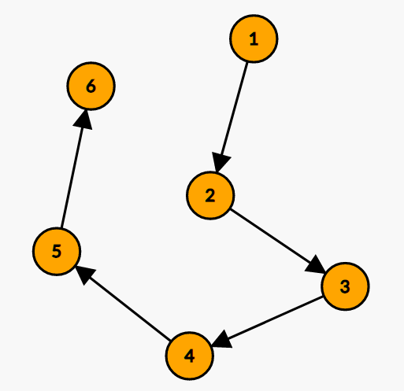
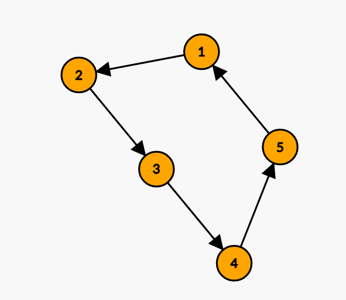
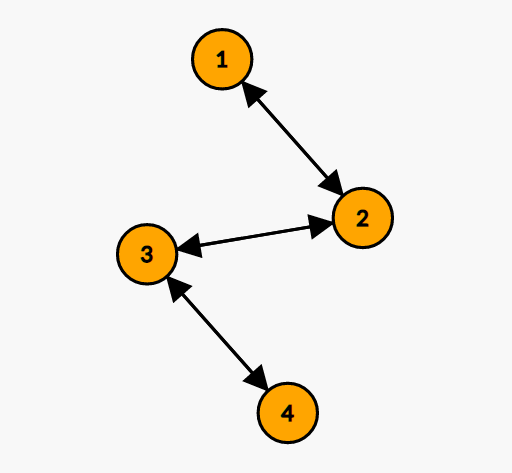
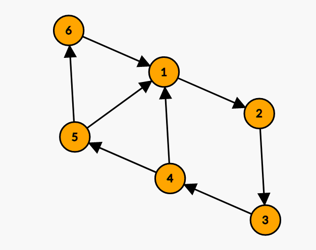
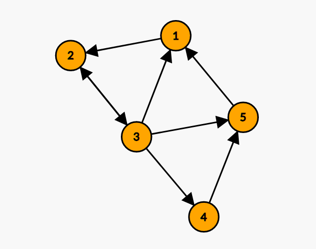
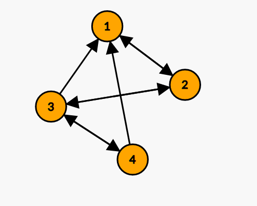

# DM HW3
Q56104076 陳哲緯

[TOC]


## install environment
```
pipenv shell
pipenv install
```
## folder structure

```
├── dataset
│   ├── graph_1.txt
│   ├── graph_2.txt
│   ├── graph_3.txt
│   ├── graph_4.txt
│   ├── graph_5.txt
│   ├── graph_6.txt
│   └── ibm-5000.txt
├── main.ipynb      // main program
├── Pipfile
├── report_imgs     // the img that report need
├── Report.md       
└── result          // output result under this folder
```

## code structure
There's only one class in main.ipynb , first build the graph,and then run algorithm
```python
class Graph():
    def __init__(self , graph_data:list ) -> None:
        # init auth and hub matrix , index
        self.init_graph(graph_data)

    def init_graph(self , graph_data:list)->None:
        return result
    
    def hits_algorithm(self , iter):
        return result
    
    def pagerank_algorithm(self,iter , d):
        return result

    def simrank_algorithm(self,iter,C):
        return result
        
    def get_simrank_score( self,node_a,node_b,old_simrank_matrix , C)->float:
        return score

# it's simple to use this class
ITER = 100
DECAY_FACTOR_C = 0.9
DAMPING_FACTOR_D = 0.15

# load data
graph_data = load_graph_data(str(d_path))

# create graph
graph= Graph(graph_data)

# get result of algorithm
hitshub,hits_auth =  graph.hits_algorithm(iter=ITER)
pagerank = graph.pagerank_algorithm(iter=ITER,d= DAMPING_FACTOR_D)
simrank = graph.simrank_algorithm(iter=ITER,C = DECAY_FACTOR_C)
```


# 1. Page rank 
## formula
$PR(p_i)=\frac{1-d}{N}+d*  \sum_{p_j\in in(p_i)}\frac{PR(p_j)}{|out(p_j)|}$

d: damping factor = 0.1~0.15
## flow
1. For every node **i** , update new page rank $PR(p_i)$ as the sum of every j $\frac{PR(p_j)}{|out(p_j)|}$ where **j** is the node that **i** point to.
2. scale result by damping factor

## implement
```python
def pagerank_algorithm(self,iter , d):
    
    # start by one
    page_rank = np.ones( self.n )
    
    for _ in range(iter):
        new_page_rank = np.zeros_like(page_rank)
        for i in range(self.n):
            # for every node points to me , update page_rank score as sum of (old_page[ni]) / (ni out links)
            for n in self.in_neighbors[i]:
                new_page_rank[i] += page_rank[n] / len(self.out_neighbors[n])
                
            page_rank = (1-d) * new_page_rank + d/self.n
    # norm
    page_rank = page_rank / (page_rank.sum())

    return page_rank
```

# 2. SimRank

## formula
$S(a,b)=\frac{C}{|I(a)||I(b)}\sum_{i=1}^{|I(a)|}\sum_{j=1}^{|I(b)|}S(I_i(a),\ I_j(b))$

I(a), I(b): all in-neighbors
O(a), O(b): all out-neighbors
C is damping factor , CÎ[0, 1]

## flow

1. For evert node pair(a,b):
   + if a==b , the simrank score of it is 1
   + if there's no node point to a or b , score is 0
   + else, go to step 2
2. update sim rank score by formula
3. scale result by damping factor

## inplement
```python
def simrank_algorithm(self,iter,C):

    simrank_matrix = np.eye( self.n )

    for _ in range(iter):
        # create new simrank matrix
        new_simrank_matrix = np.eye( self.n )
        # update every node of a:b
        for node_a in range(self.n):
            for node_b in range(self.n):
                # if node a or node b dont't have any parents,skip it
                if len(self.in_neighbors[node_a]) == 0 or len(self.in_neighbors[node_b]) == 0 or node_a == node_b: 
                    continue  
                # caculate simrank score
                new_simrank_matrix[node_a][node_b] = self.get_simrank_score( node_a,node_b,simrank_matrix,C=C )

        simrank_matrix = new_simrank_matrix.copy()
            
    return simrank_matrix
        
def get_simrank_score( self,node_a,node_b,old_simrank_matrix , C)->float:

    simrank_sum = 0.0

    for a in self.in_neighbors[node_a]:
        for b in self.in_neighbors[node_b]:
            simrank_sum += old_simrank_matrix[a][b]

    simrank_sum = (simrank_sum * C) / (len( self.in_neighbors[node_a])*len(self.in_neighbors[node_b])) 
    return simrank_sum
```


# 3. Hits

## flow
1. Assign each node an authority and hub score to 1.
2. Update authority scores: each node's authority score is the sum of hubs score of each node that point to it.
3. Update hub scores: each node's hub score is the sum of authority score of each node that it points to.
4. Normalize result
## implement

```python
def hits_algorithm(self , iter):
        
    hub_score = np.ones(self.n)
    auth_score = np.ones(self.n)

    for _ in range(iter):
        # new hub and auth score
        new_auth_score =  np.zeros( self.n )
        new_hub_score =  np.zeros( self.n )
        # auth update and hub update
        for i in range(self.n):
            new_auth_score[i]  = np.sum( hub_score[ self.in_neighbors[i] ] )
            new_hub_score[i] = np.sum( auth_score[ self.out_neighbors[i] ] )
        # norm and update
        auth_score =  new_auth_score / new_auth_score.sum()
        hub_score = new_hub_score / new_hub_score.sum()

    return hub_score , auth_score
```


# 4. Result of algorithm
##  4-1 parameters setup
+ for every experiments
  + damping factor d = **0.15**
  + dacay factor C = **0.9**
  + iterration = **100**

## 4-2 discussion
>  graph 1 - 3
<p float="left">
    
     
     
</p>

```python
Dataset [./dataset/graph_1.txt]

Authority:
[0.  0.2 0.2 0.2 0.2 0.2]
Hub:
[0.2 0.2 0.2 0.2 0.2 0. ]
PageRank:
[0.06071611 0.11232481 0.1561922  0.19347948 0.22517367 0.25211373]
SimRank:
[[1. 0. 0. 0. 0. 0.]
 [0. 1. 0. 0. 0. 0.]
 [0. 0. 1. 0. 0. 0.]
 [0. 0. 0. 1. 0. 0.]
 [0. 0. 0. 0. 1. 0.]
 [0. 0. 0. 0. 0. 1.]]

在G1中，因為node 1 沒有被任何引用因此Auth score為0，node 6沒有引用任何node 因此hub score為0，SimRank的部分，由於沒有任何兩點是有共同被引用，因此結果為對角矩陣
================================

Dataset [./dataset/graph_2.txt]

Authority:
[0.2 0.2 0.2 0.2 0.2]
Hub:
[0.2 0.2 0.2 0.2 0.2]
PageRank:
[0.2 0.2 0.2 0.2 0.2]
SimRank:
[[1. 0. 0. 0. 0.]
 [0. 1. 0. 0. 0.]
 [0. 0. 1. 0. 0.]
 [0. 0. 0. 1. 0.]
 [0. 0. 0. 0. 1.]]

在G2，SimRank同上。由於是循環圖，因此 Auth、Hub、PageRank score每個項目都是一樣的分數
================================

Dataset [./dataset/graph_3.txt]

Authority:
[0.19098301 0.30901699 0.30901699 0.19098301]
Hub:
[0.19098301 0.30901699 0.30901699 0.19098301]
PageRank:
[0.17543859 0.32456141 0.32456141 0.17543859]
SimRank:
[[1.         0.         0.81818182 0.        ]
 [0.         1.         0.         0.81818182]
 [0.81818182 0.         1.         0.        ]
 [0.         0.81818182 0.         1.        ]]

在G3PageRank score在2和4很高，是因為3同時引用2和4，而1和3的相似度很高也是因為兩者同時被2引用
================================
```

# 5 Find a way

## 5-1 Graph 1

<p float="left">
  
   
</p>


```
Before:
	Hub [0.2 0.2 0.2 0.2 0.2 0. ] Auth [0.  0.2 0.2 0.2 0.2 0.2] 
	PageRank [0.061 0.112 0.156 0.193 0.225 0.252]
After:
	Hub [0.  0.  0.  0.5 0.5 0. ] Auth [0.5  0.   0.   0.   0.25 0.25] 
	PageRank [0.181 0.191 0.201 0.209 0.127 0.092]
```
## 5-2 Graph 2

<p float="left">
  
   
</p>

```
Before:
	Hub [0.2 0.2 0.2 0.2 0.2] Auth [0.2 0.2 0.2 0.2 0.2] 
	PageRank [0.2 0.2 0.2 0.2 0.2]
After:
	Hub [0.147 0.    0.558 0.147 0.147] Auth [0.264 0.264 0.    0.209 0.264] 
	PageRank [0.22  0.273 0.262 0.086 0.159]
```
## 5-3 Graph 3

<p float="left">
  
   
</p>

```
Before:
	Hub [0.191 0.309 0.309 0.191] Auth [0.191 0.309 0.309 0.191] 
	PageRank [0.175 0.325 0.325 0.175]
After:
	Hub [0.079 0.298 0.324 0.298] Auth [0.41  0.18  0.266 0.144] 
	PageRank [0.301 0.36  0.235 0.104]
```