# HW2

Q56104076 陳哲緯

# 安裝 & 執行方式

執行後會顯示圖表，並且儲存為 `{方法}.png`

方法實作在 methods/n_dim.py 和 methods/one_dim.py 內

```
pip install -r requirements.txt
python Q1.py
python Q2.py
python Q3.py
```

# Q1

> 實作 `Golden Search` 和 `Fibonacci Search`

- 兩者都是在左邊界 range_min 和右邊界 range_max 中選出兩點 X1, X2 來判斷函數值，刪除較大者到邊界的區域
- 在這次作業 Fibonacci search 迭代數量比 Golden search 少

## Golden Search

```python
# 重複迭代直到達成跳出條件
# range_min---x1---x2---range_max
for i in range(100):
    # 跳出條件
    if range_max-range_min < epsilon:
        break

    # compare function value and update range
    f_x1 = target_func(x1)
    f_x2 = target_func(x2)

    # 刪除較大數值~邊界的區域
    if f_x2 > f_x1:
        range_max = x2
        x2 = x1
        x1 = range_max - (range_max - range_min) / golden_ratio
    else:
        range_min = x1
        x1 = x2
        x2 = range_min + (range_max - range_min) / golden_ratio
```

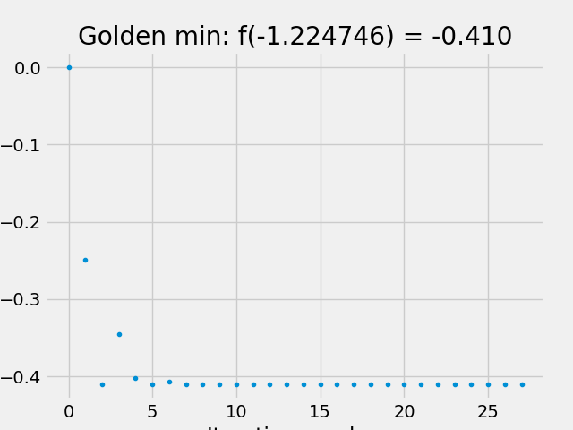

## Fibonacci Search

```python
# 決定 Fibonacci 要多少次迭代: 讓最後一個 Fibonacci 數字 > (range_max-range_min)/epsilon
while fibonacci_list[-1] < (range_max-range_min)/epsilon:
    fibonacci_list.append(fibonacci_list[-2] + fibonacci_list[-1])
```

```python
# 重複迭代直到達成跳出條件
# range_min---x1---x2---range_max
for n in range(len(fibonacci_list)-2, 1, -1):
	f_x1 = target_func(x1)
	f_x2 = target_func(x2)
	# 透過 fibonacci 數列來將 range_min~range_max 切成4個區域
    if f_x2 > f_x1:
        range_max = x2
        x2 = x1
        x1 = range_min + \
            (fibonacci_list[n-2] / fibonacci_list[n]) * \
            (range_max-range_min)
    else:
        range_min = x1
        x1 = x2
        x2 = range_min + \
            (fibonacci_list[n-1] / fibonacci_list[n]) * \
            (range_max-range_min)
```

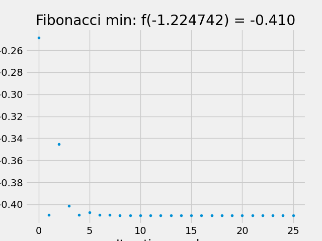

# Q2

> 實作 `Hooke–Jeeves Pattern Search Method`

1. 初始化 step_size 為 step_size_x1, step_size_x2 = 0.001, 0.001
2. 固定 `x2` ， 比較 x1 + step_size_x1 , x1 - step_size_x1 是否為更優的解，如果是就更新成 `x1_next`
3. 固定 `x1_next` ，比較 f(x1_next, x2 + step_size(x2)), f(x1_next, x2), f(x1_next, x2+ step_size(x2)) 的函數值，並更新 x2 成 x2_next
4. 計算方向 S = [x1_next, x2_next] - [x1, x2] ，並沿著方向直到函數值不再變小

```python
for i in range(100):
	# 比較 f(x1 + step_size(x1), x2), f(x1, x2), f(x1-step_size(x1), x2) 的函數值
    fx1 = target_func(x1, x2)
    x1_test_add = target_func(x1 + step_size[0], x2)
    x1_test_minus = target_func(x1 - step_size[-1], x2)
    x1_next = x1

    if x1_test_add < x1_test_minus and x1_test_add < fx1:
    	x1_next = x1 + step_size[0]
    elif x1_test_minus < x1_test_add and x1_test_minus < fx1:
        x1_next = x1 - step_size[0]

    x_list.append([x1_next, x2])
    y_list.append(target_func(x1_next, x2))

    # 比較 f(x1_next, x2 + step_size(x2)), f(x1_next, x2), f(x1_next, x2+ step_size(x2)) 的函數值
    fx2 = target_func(x1_next, x2)
    x2_test_add = target_func(x1_next, x2 + step_size[1])
    x2_test_minus = target_func(x1_next, x2 - step_size[1])
    x2_next = x2

    if x2_test_add < x2_test_minus and x2_test_add < fx2:
    	x2_next = x2 + step_size[0]
    elif x2_test_minus < x2_test_add and x2_test_minus < fx2:
        x2_next = x2 - step_size[0]

    x_list.append([x1_next, x2_next])
    y_list.append(target_func(x1_next, x2_next))

    # 沿著方向直到函數值不再變小
    s1, s2 = x1_next-x1, x2_next-x2

    if s1 == s2 and s1 == 0:
    	break
    # check range first
    while x1_range[0] <= x1_next + s1 <= x1_range[1] and \
    	x2_range[0] <= x2_next + s2 <= x2_range[1]:
    # walk along direction until stop improve
    if target_func(x1_next + s1, x2_next + s2) < target_func(x1_next, x2_next):
    	x1_next += s1
    	x2_next += s2
    else:
    	break
```

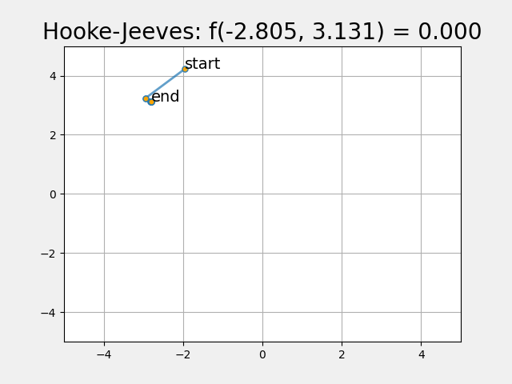

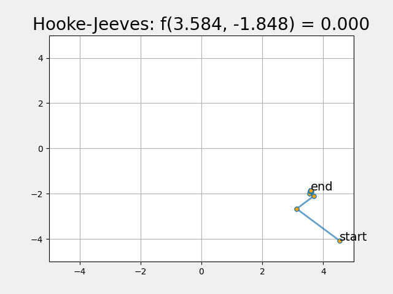

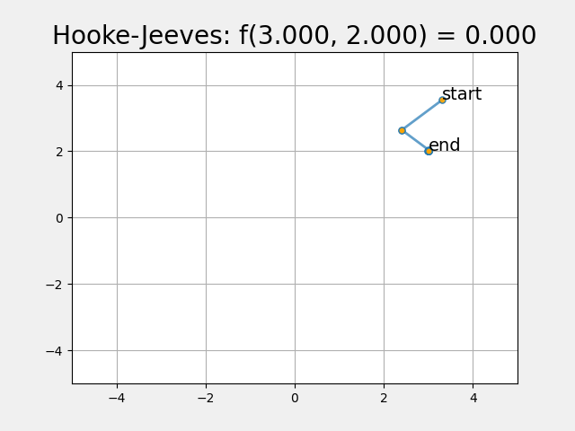

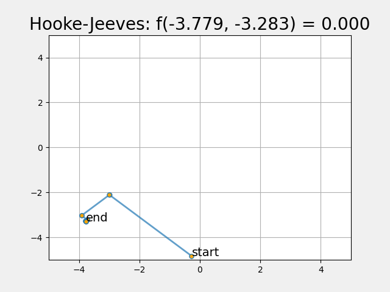

# Q3

> 實作 `Powell Method`

- 跟 Hooke–Jeeves Pattern Search Method 不同在於，搜索下一步方向時簡化問題為 one-dimensional 問題來，一次更新變數到最佳解而不是只確認方向

* 在實作中用 golden search 來搜尋變數最佳解

```python
for i in range(100):
    # find best lambda and update x_1 = x_1 + lambda * s1
    x1_next = golden_search(
        x1_range[0], x1_range[1], lambda a: target_func(a, x2))[0][-1]
    x_list.append([x1_next, x2])
    y_list.append(target_func(x1_next, x2))

    # find best lambda and update x_2 = x_2 + lambda * s2
    x2_next = golden_search(
        x2_range[0], x2_range[1], lambda a: target_func(x1_next, a))[0][-1]
    x_list.append([x1_next, x2_next])
    y_list.append(target_func(x1_next, x2_next))

    # get direction
    s1 = x1_next - x1
    s2 = x2_next - x2

    # find lambda to minimize f(X + lambda*S)
    lambda_max, lambda_min = float('inf'), float('-inf')
     lambda_max = min((x1_range[1]-x1_next)/(s1+epsilon),
                       (x2_range[1]-x2_next)/(s2+epsilon))
      lambda_min = max((x1_range[0]-x1_next)/(s1+epsilon),
                        (x2_range[0]-x2_next)/(s2+epsilon))

       if lambda_max <= lambda_min:
            _lambda = 0
        else:
            _lambda = golden_search(lambda_min, lambda_max, lambda a: target_func(
                x1_next + a*s1, x2_next + a*s2))[0][-1]

        x1 = x1_next + _lambda*s1
        x2 = x2_next + _lambda*s2
        x_list.append([x1, x2])
        y_list.append(target_func(x1, x2))

        # break condition |( f(x*) – q(x*) )/f(x*) | < 10-7
        if abs((prev_fx - y_list[-1])/prev_fx) <= epsilon:
            break
        prev_fx = y_list[-1]

```

## Powell Method

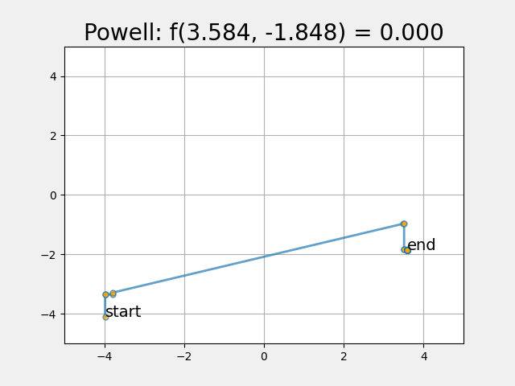

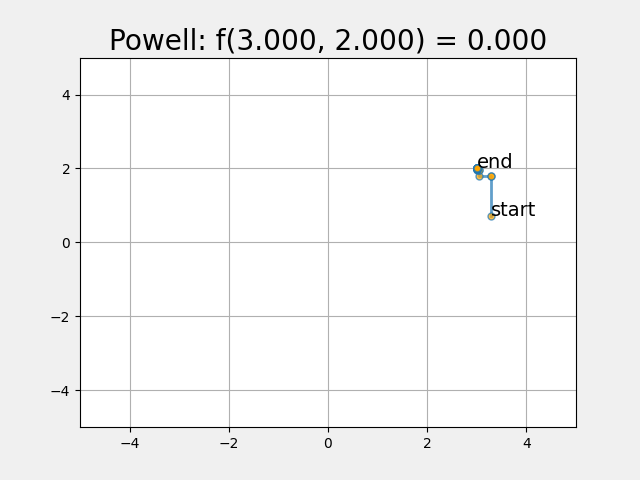

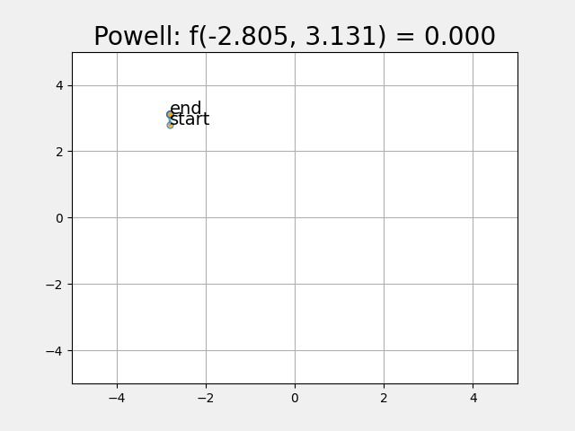

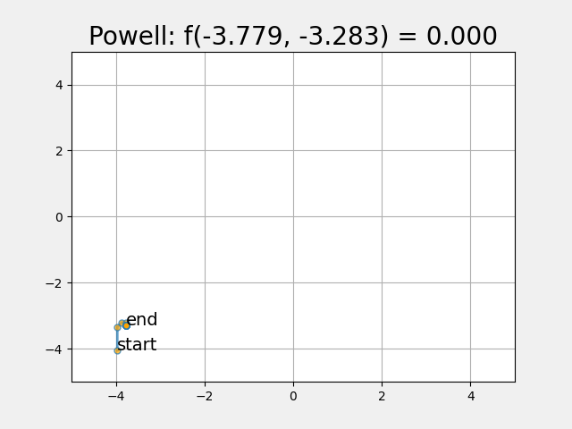

# Himmelblau's function

此函數有 4 個最小值，因此 Q2-Q3 會有 4 種搜尋結果(根據不同的起點)

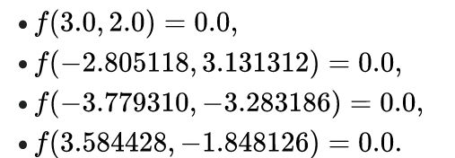
