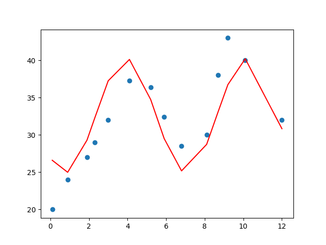

# HW2
by <`Q56104076 陳哲緯`>

+ Suppose you are given this data set:
x = [0.1, 0.9, 1.9, 2.3, 3, 4.1, 5.2, 5.9, 6.8, 8.1, 8.7, 9.2, 10.1,12]
y = [20, 24, 27, 29, 32, 37.3, 36.4, 32.4, 28.5, 30, 38, 43, 40, 32].

## Q1
> Find (analytically) the coefficients of the best-fit linear and quadratic regression equations. You can do it by hand or use some computer software to perform the calculation.


### Quadratic coefficient

$$
\begin{pmatrix}
21.262 \\
3.566 \\
-0.206 \\
\end{pmatrix}
$$

### Linear coefficient

$$
\begin{pmatrix}
25.584 \\
1.167  \\
\end{pmatrix}
$$

```python
def main():
    x= np.array([0.1, 0.9, 1.9, 2.3, 3, 4.1, 5.2, 5.9, 6.8, 8.1, 8.7, 9.2, 10.1,12])
    y= np.array([20, 24, 27, 29, 32, 37.3, 36.4, 32.4, 28.5, 30, 38, 43, 40, 32])

    # get coefficients
    coeffs_2d = np.polyfit(x, y, 2)
    coeffs_1d = np.polyfit(x, y, 1)
    print(f"Quadratic: {coeffs_2d}")
    print(f"Linear: {coeffs_1d}")

    # plot equations
    plt.scatter(x, y)

    # equations
    polynomial = np.poly1d(coeffs_2d)
    linear = np.poly1d(coeffs_1d)

    _x = np.linspace(x.min(), x.max(), 100)
    polynomial_y = [ polynomial(i) for i in _x ]
    linear_y = [ linear(i) for i in _x ]

    plt.plot(_x, polynomial_y, 'r-' )
    plt.plot(_x, linear_y, 'g-', )

    # save plot to png file
    plt.savefig('./result/q1.png')

```

## Q2

> Find the coefficients of the best-fit linear and quadratic regression equations numerically. First, use Fletcher-Reeves conjugate gradient method. Then use one of the methods involving Newton’s method or one of the quasi-Newton methods (DFP or BFGS).

### Minimize target:

$$
f(a, b) = \sum_{i=1}^n (ax_i + b - y_i)^2
$$

### Fletcher Reeves


最後幾輪的 iter 和 mse，跟 q1 求出的 a0 和 a1 相同
```
Iter 452: a = 1.168, b = 25.583, f(a, b) = 284.494
Iter 453: a = 1.168, b = 25.583, f(a, b) = 284.494
Iter 454: a = 1.168, b = 25.583, f(a, b) = 284.494
Iter 455: a = 1.168, b = 25.583, f(a, b) = 284.494
[1.16772750475366 25.5830691861483]
```

### Quasi Newton
```
Iter: 0  Xi: [4.96113281250000 1.69785156250000]
Iter: 1  Xi: [1.80947181225433 25.5475388094094]
Iter: 2  Xi: [1.16647825937387 25.5831983718773]
Iter: 3  Xi: [1.16758943078033 25.5841248288175]
[1.16758943078033 25.5841248288175]
```
###
```python

from cmath import inf
from readline import set_startup_hook
from sympy import diff, symbols
import numpy as np
import math


# the equation should pass a and b symbols
def armijo(Xi: np.array, direction: np.array, equation) -> float:

    max_iter = 3
    # ε
    epsilon = 0.2
    a, b, lambda_ = symbols("a,b,lambda_")

    # x_i+1 = x_i + direction * lambda
    X_next = Xi + lambda_ * direction

    lambda_func = equation.subs([[a, X_next[0]], [b, X_next[1]]])
    diff_lambda_func = diff(lambda_func, lambda_)

    mse_func = lambda_func.subs(lambda_, 0) + \
        diff_lambda_func.subs(lambda_, 0)*epsilon*lambda_

    best_lambda = 1.0

    for iter in range(1, 100):
        func_val = lambda_func.subs(lambda_, best_lambda)
        F_val = mse_func.subs(lambda_, best_lambda)

        if func_val >= F_val:
            best_lambda /= 2.0
        else:
            if iter >= max_iter:
                return best_lambda
            best_lambda *= 2

    return best_lambda


# mse_func(x) = ax + b = y_pred
# we try to minimize  mean squred error(y_pred, y_label) = (mse_func(x) - y)^2 = (ax+b-y)^2
def fletcher_reeves(x: np.array, y: np.array, Xi: np.array, max_iter=1000):

    # ε
    epsilon = 0.01

    a, b = symbols("a, b")
    mse_func = ((a*x + b - y)**2).sum()

    gradient_func = [diff(mse_func, a), diff(mse_func, b)]

    for iter in range(1, max_iter+1):

        to_sub = [[a, Xi[0]], [b, Xi[1]]]
        # direction = -gradient(x_i)
        gradient = np.array([gradient_func[0].subs(
            to_sub), gradient_func[1].subs(to_sub)])
        direction = -1 * gradient

        if math.sqrt((direction**2).sum()) < epsilon:
            break

        # find best lambda by armijo
        lambda_ = armijo(Xi, direction, mse_func)

        # X_(i+1) = X_i + λ * direction
        Xi = Xi + lambda_ * direction

        to_sub = [[a, Xi[0]], [b, Xi[1]]]

        print(
            f"Iter {iter}: a = {Xi[0]:.3f}, b = {Xi[1]:.3f}, f(a, b) = {mse_func.subs(to_sub)/len(x):.3f}")

        gradient_next = np.array([gradient_func[0].subs(
            to_sub), gradient_func[1].subs(to_sub)])

        # cacualte next direction
        beta = (gradient_next.T @ gradient_next) / (gradient.T @ gradient)
        direction = -1 * gradient_next + beta * direction

        if math.sqrt((direction**2).sum()) < epsilon:
            break

    return Xi


def quasi_newton(x: np.array, y: np.array, Xi: np.array, degree: int = 1, epsilon: float = 0.001, max_iter: int = 100):

    a, b = symbols("a,b")

    #f(a, b) = (mx + b - y)^2.
    f = ((a * x + b - y) ** 2).sum()

    gradient_func = [diff(f, a), diff(f, b)]

    beta = np.identity(degree + 1)

    for step in range(max_iter):

        to_sub = [[a, Xi[0]], [b, Xi[1]]]
        df_val = np.array([gradient_func[0].subs(to_sub), gradient_func[1].subs(to_sub)])

        s = -1 * beta @ df_val

        if math.sqrt((s**2).sum()) < epsilon:
            break

        # Find proper lambda value.
        lambda_val = armijo(Xi, s, f)

        # Update Xi = (a , b).
        p_new = Xi + lambda_val * s
        to_sub = {a: p_new[0], b: p_new[1]}
        df_new_val = np.array([gradient_func[0].subs(to_sub), gradient_func[1].subs(to_sub)])

        d = p_new - Xi
        g = df_new_val - df_val
        d, g = d[:, None], g[:, None]

        beta = beta + (d @ d.T)/(d.T @ g) - \
            (beta @ g @ g.T @ beta)/(g.T @ beta @ g)
        s = -1 * beta @ df_new_val

        # Update Xi.
        Xi = p_new


        print(f"Iter: {step}\t Xi: {Xi}")

    return Xi


def main():

    x = np.array([0.1, 0.9, 1.9, 2.3, 3, 4.1, 5.2,
                  5.9, 6.8, 8.1, 8.7, 9.2, 10.1, 12])
    y = np.array([20, 24, 27, 29, 32, 37.3, 36.4,
                  32.4, 28.5, 30, 38, 43, 40, 32])

    start_point = np.array([1.0, 1.0])

    ans = fletcher_reeves(x, y, start_point, 1000)
    print(ans)

    print("\n\n")

    ans = quasi_newton(x, y, start_point)
    print(ans)


if __name__ == "__main__":
    # print(diff(func, a))
    main()

```


## Q3
> With polynomial regression, decide the order of the polynomial which reasonably fits the data without making the order too high.

在一定 degree 範圍內透過 mean squared error 算出多項式與真實的誤差，來得知哪個 degree 是最好的


```python
from cmath import inf
import numpy as np
import matplotlib.pylab as plt


# mean squared error of y_pred and y_label
def MSE(y_pred:np.array, y_label:np.array):
    return ((y_pred-y_label)**2).sum()/len(y_label)

def main():

    x = np.array([0.1, 0.9, 1.9, 2.3, 3, 4.1, 5.2,
                 5.9, 6.8, 8.1, 8.7, 9.2, 10.1, 12])
    y = np.array([20, 24, 27, 29, 32, 37.3, 36.4,
                 32.4, 28.5, 30, 38, 43, 40, 32])

    min_mse, min_degree = inf, 1

    for i in range(1, 20):
        # find coefficient at degree i
        coeff = np.polyfit(x, y, i)
        polynomial = np.poly1d(coeff)

        # caculate mse error
        y_pred = [ polynomial(_x) for _x in x]
        mse_error = MSE(y_pred, y)

        print(f"Degree {i:>2}: MSE = {mse_error:.3f}")

        if mse_error < min_mse:
            min_mse, min_degree = mse_error, i

        # if mse error is small enough, break loop
        if min_mse < 1e-3:
            break

    print(f"Best degree is {min_degree:>2}, MSE: {min_mse:.3f}")

if __name__ == "__main__":
    main()
```

### Result
```
Degree  1: MSE = 20.321
Degree  2: MSE = 14.615
Degree  3: MSE = 14.460
Degree  4: MSE = 10.818
Degree  5: MSE = 5.139
Degree  6: MSE = 5.121
Degree  7: MSE = 1.275
Degree  8: MSE = 0.223
Degree  9: MSE = 0.127
Degree 10: MSE = 0.105
Degree 11: MSE = 0.101
Degree 12: MSE = 0.015
Degree 13: MSE = 0.000
Best degree is 13, MSE: 0.000
```

## Q4

> Use your creativity to construct the regression model (i.e. combining polynomial, sin, cos, exponential, and/or log functions) which best fits the data. For example, you may assume that y = c1sin(x) + c2ex , where c1 and c2 are the coefficients to be determined. Also, describe your reasons for choosing certain functions in your model.

由於題目給的 (x,y) 看起來像是 sin + cos 的週期，因此設計以下多項式
$$
y = a_0 + a_1*sin(x) + a_2*cos(x)
$$

### Coefficient

$$
a_0 = 32.588 \\ a_1=-5.354 \\ a_2 = -5.481
$$


### Mean squared error

$$
MSE(y_{pred}, y_{label}) = 13.136
$$



+  找到多項式係數 [link](http://mirlab.org/jang/books/matlabprogramming4guru/10-8_lseDerivation.asp?title=10-8%2520%25B3%25CC%25A4p%25A5%25AD%25A4%25E8%25AAk%25AA%25BA%25B1%25C0%25BE%25C9&fbclid=IwAR3LoMPdTPyae2d75El7GdqBeYrFZCEOilFYdFF5epfOz7TFTC53wuIBgLs)

```python
import numpy as np
import matplotlib.pylab as plt
import math


# mean squared error of y_pred and y_label
def MSE(y_pred: np.array, y_label: np.array):
    return ((y_pred-y_label)**2).sum()/len(y_label)


def find_coef(x, y):

    matrix = [np.ones(len(x))]
    matrix.append([math.sin(_) for _ in x])
    matrix.append([math.cos(_) for _ in x])

    A = np.array(matrix).T
    coef = np.linalg.inv(A.T @ A) @ A.T @ y[:, None]

    return coef


def get_equ_val(x, coef):

    coef = coef.squeeze()

    matrix = [np.ones(len(x))]
    matrix.append([math.sin(_) for _ in x])
    matrix.append([math.cos(_) for _ in x])

    matrix = np.array(matrix).T

    return matrix.dot(coef)


def main():
    x = np.array([0.1, 0.9, 1.9, 2.3, 3, 4.1, 5.2,
                 5.9, 6.8, 8.1, 8.7, 9.2, 10.1, 12])
    y = np.array([20, 24, 27, 29, 32, 37.3, 36.4,
                 32.4, 28.5, 30, 38, 43, 40, 32])

    # plot dot
    plt.scatter(x, y)

    # find best coef of my equation
    coef = find_coef(x, y)

    print(f"Coef: {coef}")
    y_pred = get_equ_val(x, coef)

    plt.plot(x, y_pred, 'r')

    # save plot to png file
    plt.savefig('./result/q4.png')

    mse = MSE(y_pred, y)
    print(f"MSE: {mse:.3f}")


if __name__ == "__main__":
    main()
```